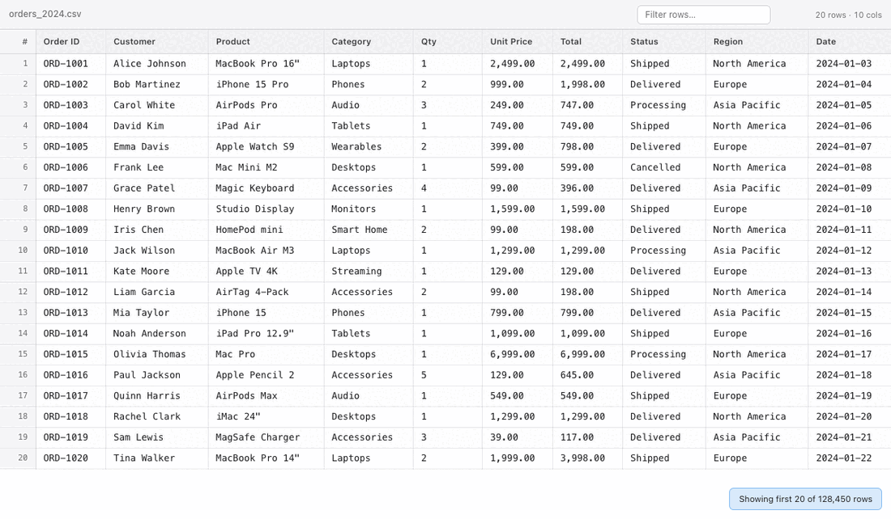
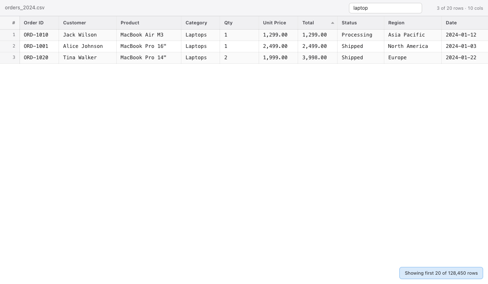
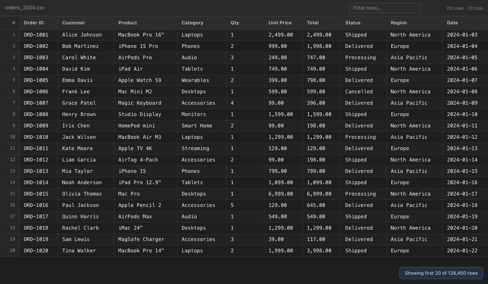

<div align="center">

# CSV Quick Look

**A macOS QuickLook extension that turns CSV files into a proper spreadsheet preview**




</div>

---

macOS ships with a plain-text preview for `.csv` files. CSV Quick Look replaces it with a spreadsheet-style view that handles files with hundreds of thousands of rows without breaking a sweat — just press **Space** in Finder.

## Features

- **Instant preview** — press Space on any `.csv` or `.tsv` file in Finder
- **Virtual scroll** — only visible rows are in the DOM; handles 500k+ row files smoothly
- **Column sort** — click any header to sort ascending/descending (numeric-aware)
- **Row filter** — live search across all columns, Escape to clear

  

- **Auto-detect delimiter** — comma, tab, semicolon, or pipe, chosen automatically
- **Encoding support** — UTF-8, UTF-8 BOM, UTF-16 LE/BE, Windows-1252, Latin-1
- **Dark mode** — follows the system appearance automatically

  

- **Row numbers** — always visible as a sticky left column
- **Truncation notice** — shown when the file exceeds the configured row limit

## Requirements

| | |
|---|---|
| macOS | 12 Monterey or later |
| Xcode | 15 or later (to build from source) |

No dependencies. No network access. Fully sandboxed.

## Install

### Homebrew (recommended)

```bash
brew install --cask adamorad/tap/csv-quick-look
```

Then enable the extension:

**System Settings → Privacy & Security → Extensions → Quick Look → enable CSV Quick Look**

> On macOS 12–13: System Preferences → Extensions → Quick Look.

---

### Build from source

If you prefer to build yourself (e.g. to customise the bundle ID):

**1. Clone**

```bash
git clone https://github.com/adamorad/csv-quick-look.git
cd csv-quick-look
```

**2. Update the bundle ID** *(optional)*

In `project.yml`, change the `bundleIdPrefix` to your own reverse-domain:

```yaml
options:
  bundleIdPrefix: com.yourname   # ← change this
```

**3. Open in Xcode and run**

```bash
open CSVQuickLook.xcodeproj
```

Select the **CSVQuickLook** scheme → **My Mac** → **⌘R**. The app installs the extension on launch.

**4. Enable the extension** as above.

## Settings

Launch **CSV Quick Look.app** at any time to adjust:

| Setting | Default | Description |
|---|---|---|
| Auto-detect delimiter | On | Detects comma, tab, semicolon, or pipe. When off, comma is used. |
| Max rows to display | 100,000 | Upper limit for the preview. Higher values use more memory. |

## How it works

The extension is a standard `QLPreviewingController` backed by a `WKWebView`:

1. **Swift** reads the file, detects encoding and delimiter, parses the CSV on a background thread.
2. It loads a local `preview.html` into the web view.
3. Once the page is ready, it calls `initTable(headers, rows, …)` via JS injection.
4. **JavaScript** builds a virtual-scroll table — only rows in the viewport touch the DOM.

## Project structure

```
csv-quick-look/
├── Shared/
│   └── CSVParser.swift               # Encoding detection, delimiter sniff, RFC 4180 parser
├── CSVQuickLook/
│   ├── App.swift                     # SwiftUI app entry point
│   └── ContentView.swift             # Settings UI
├── CSVQLExtension/
│   ├── PreviewViewController.swift   # QLPreviewingController + WKWebView bridge
│   └── Resources/
│       ├── preview.html              # Page shell
│       ├── style.css                 # Light + dark themes
│       └── table.js                  # Virtual scroll, sort, filter
└── project.yml                       # XcodeGen spec
```

## Contributing

Pull requests are welcome. Open an issue first for significant changes.

The JS/CSS frontend can be iterated without rebuilding the Swift target — edit the files in `CSVQLExtension/Resources/` and reload the QuickLook preview.

## Star history

<a href="https://star-history.com/#adamorad/csv-quick-look&Date">
  <picture>
    <source media="(prefers-color-scheme: dark)" srcset="https://api.star-history.com/svg?repos=adamorad/csv-quick-look&type=Date&theme=dark" />
    <source media="(prefers-color-scheme: light)" srcset="https://api.star-history.com/svg?repos=adamorad/csv-quick-look&type=Date" />
    
  </picture>
</a>

## License

MIT — see [LICENSE](LICENSE).
